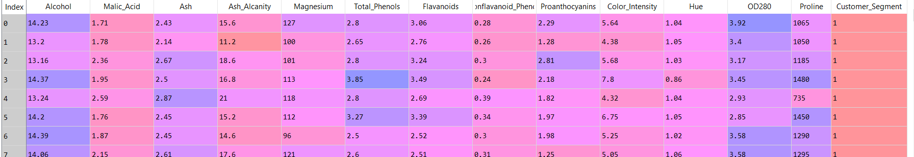
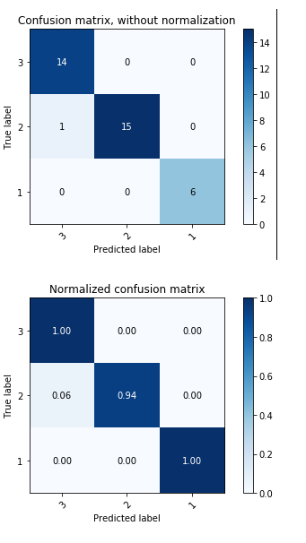
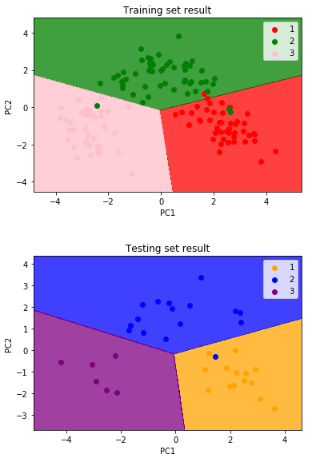
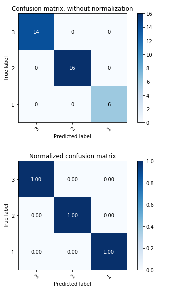

Logistic-regression-dimensionality-reduction
Using the principal component analysis to find the two main features to represent the 13 various wine characteristics and develop a logistic regression model to predict the customer types using the two features as the inputs.  

# Problem statement

A wine company collected the 13 features of their wine products, also its marketing team cluster their target customers into three types. The company looking for a model to find the hidden characteristics that determine the customer type, and develop the model to help the marketing team to recognize the future customer type. 

# Data
The data resource is from the UCI machine learning repository.
The dataset containing 13 features and the customer segment information.
The partially screenshot is shown below:

# Reduce the features
## Principle
The principle to reduce the 13 features of the wine products to less is by finding the hidden layers that can explain most of the variance of the features. In this case, principal component analysis (PCA) is applied to project the 13 variables into smaller dimensional subspace. 

The visualization of the abstract PCA application can see from this link: http://setosa.io/ev/principal-component-analysis/

## Result
The 12 variance ratio after applied the ACP shows the top two components explain 36.88% and 19.32% respectively. Altogether the top two components already can explain the over 50% of the variance of the 13 features, which is sufficient enough to represent the 13 wine features to make a prediction. Hence, we are selecting the top two components pca1 and pca2 to further develop the logistic regression model. Reduce to the two dimensions is the best way to visualize the model and easier to interpret.

# Logistic regression model
In the multiclass logistic regression model, the model re-runs the binary classification model several times and predict the probability of the observation fill into the single class (Customer type 1, customer type 2, or customer type 3).

As shown in the confusion matrix the model does pretty well with the prediction, only 1 point is misclassified.

See from the training set result visualization graph, that data point is recognized as customer type 1 instead of the customer type 2.

Except that, the model has a very high accuacy 97.22%.

# Comparision with Linear Discriminant Analysis
Because in this business case the cluster of the customers is known, so LDA is an appropriate dimensionality reduction methodology to find the axes best separate the classes. 

## Results
LDA finally select the two features to project the data into the subspace. After input the transform data into the logistic regression model, the newly trained model shows even better performance. The testing result reveals the new model successfully classified all the testing data. The accuracy increased to 100%.  

